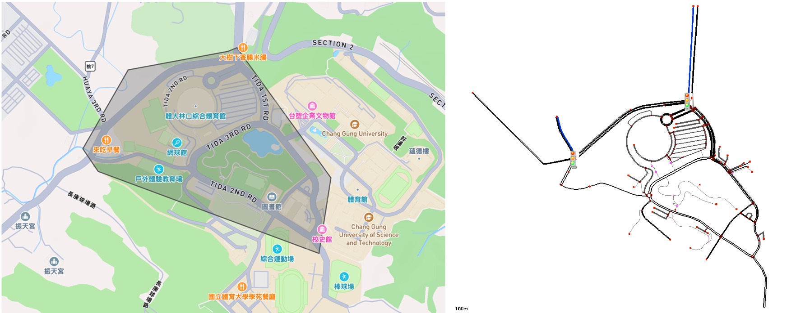

# Traffic Simulator with SUMO
This project is a traffic simulation tool using SUMO (Simulation of Urban MObility). It allows users to simulate and analyze traffic flow, optimize routes, and study the impact of various traffic scenarios.



### Features
- Simulate traffic flow in urban environments.
- Visualize vehicle movements and traffic patterns.
- Customize road networks and traffic configurations.
- Analyze traffic data for optimization and planning.

### Prerequisites
- Python 3.x
- SUMO (Simulation of Urban MObility)

### Installation
1. Install SUMO by following the [official installation guide](https://sumo.dlr.de/docs/Installing.html).
2. Clone this repository:
    ```bash
    git clone https://github.com/anhkhoa039/traffic-simulator-sumo.git
    ```
3. Install required Python dependencies:
    ```bash
    pip install -r requirements.txt
    ```

### Usage
1. Prepare SUMO configuration files (`.net.xml`, `.rou.xml`, etc.).
2. Run the simulation:  
- Run simulation with default strategy
    ```bash
    sumo-gui -c map/my_sumo_net.sumocfg 
    ```
- Run simulation with **TraCI (Traffic controll Interface)**:
    ```python
    python src/adaptive_trafficlight.py
    ```

3. View the simulation results and analyze traffic patterns.

### File Structure
- `src/adaptive_trafficlight.py`: Main script to run the simulation.
- `map/`: Directory containing SUMO configuration files.
- `output/`: Directory for output data.
- `extracted/`: Directory for input data (breakdown the map into smaller component for understanding).
- `README.md`: Project documentation.


### Acknowledgments
- [SUMO](https://sumo.dlr.de/) for providing the simulation framework.
- Open-source contributors for their tools and libraries.
- Inspiration from urban traffic management studies.